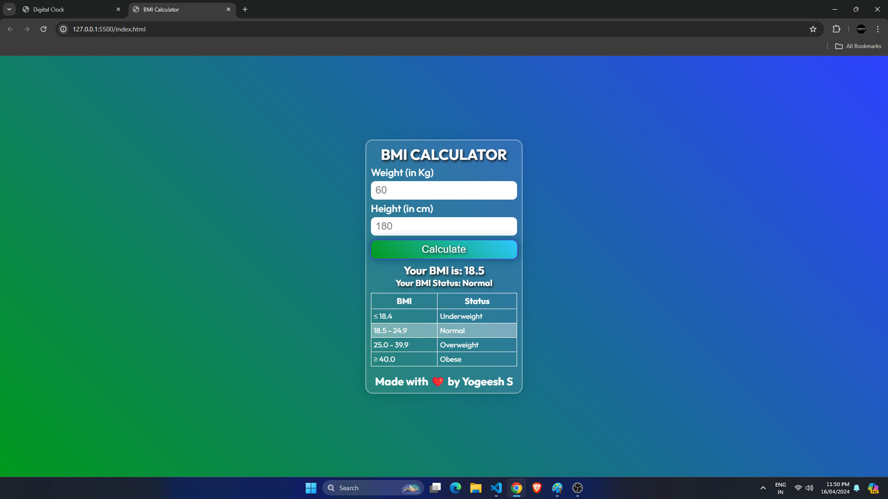

# BMI Calculator Web App

Welcome to the BMI (Body Mass Index) Calculator web application! This app allows users to quickly calculate their BMI based on their weight and height, providing valuable insights into their health status.

## Features

- **BMI Calculation:** Input your weight (in kilograms) and height (in centimeters) to calculate your BMI.
- **BMI Status:** Determine whether you are underweight, normal, overweight, or obese based on your BMI calculation.
- **Responsive Design:** The app is designed to work seamlessly across various devices and screen sizes.

## How to Use

1. Open the `index.html` file in any web browser.
2. Enter your weight and height in the respective input fields.
3. Click on the "Calculate" button to see your BMI and status.

## Files Included

- `index.html`: Contains the structure and content of the web page.
- `style.css`: Defines the styles for the web page elements.
- `script.js`: Contains the JavaScript code for BMI calculation and status determination.

## Live Demo

You can try out the BMI Calculator web app live [here](https://yogeesh-s.github.io/Simple-BMI-Calculator-Web-App-Calculate-Your-Body-Mass-Index-Online/). Simply click the link to access the app and start calculating your BMI instantly!

Feel free to input different weight and height values to see how your BMI changes. If you have any feedback or suggestions, don't hesitate to let us know.

Enjoy using the BMI Calculator web app!

## Screenshots

## Contribution

Contributions are welcome! Feel free to fork this repository, make improvements, and submit a pull request. 

## Credits

- **Fonts:** Google Fonts (Outfit, Poppins)

## License

This project is licensed under the [MIT License](https://opensource.org/licenses/MIT).

## Repository Link

[GitHub repository link here](https://github.com/yogeesh-s)

Enjoy using the BMI Calculator web app! If you have any questions or feedback, feel free to reach out.
